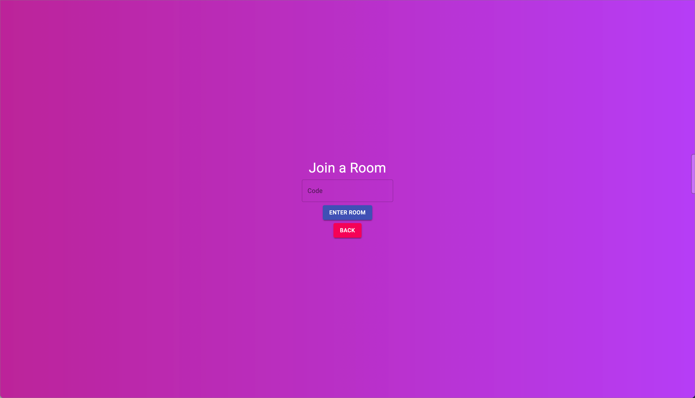

# Shared Music Rooms
This project allows users to join shared music rooms in which guests and hosts have shared control over a spotify music account's currently playing music. 
The application connects with Spotify's API and allows hosts to create rooms where they can control setting such as allowing guests to vote to skip songs and allowing guests to pause the music.
The application allows guests to join any room via room-code where they will be able to see the current playing song. 
The application also supports sessions making rejoining rooms seamless. 

Press "Open in Gitpod" button below to view!

# Frameworks
Django, React
 
# Requirements
A user with a Spotify Premium account

# How-To
1) Create a new room and sign in to your spotify account when directed. 
2) Share your unique room code with your guests. 
3) Guests can join by clicking "Join a Room" and entering the room code you shared with them. 
4) Room setting can be adjusted while a room is active thorugh the settings menu. 

# Run in Gitpod

You can also run my Shared Music Rooms project in Gitpod, a free online dev environment for GitHub:

# Screenshots

